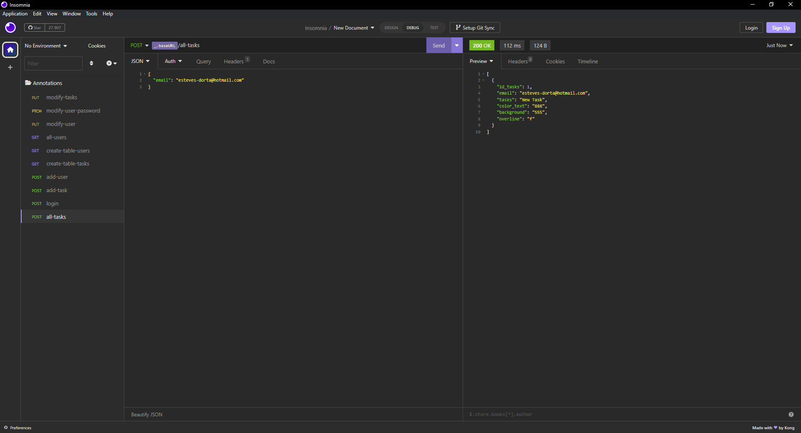
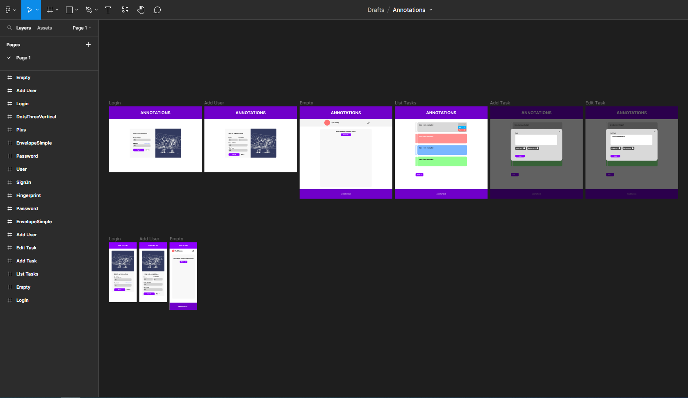

# MY ANNOTATIONS 🔥🔥🚀

This project is made with react, mysql, typescript, express, sass, ....

## Code 👨‍💻

Primeiro vou começar instalando e configurando o backend

    mkdir my-annotations
    |
    cd my-annotations
        |
        mkdir server
        |
        cd server

    Para criar o arquivo packege.json
    npm init --y

    Para liberar acesso do backend para o frontend
    npm i cors

    Para que a variável passada seja protegida, não ficando publica
    npm i dotenv

    Para criar os endpoints
    npm i express

    Para criar a conexão com o banco de dados
    npm i mysql2

Instalando bibliotecas de dependência de desenvolvimento, pois só serão usadas para desenvolver o projeto. Ou seja, essas bibliotecas não são instaladas no servidor.

    Para criar os tipos em typescript
    npm i -D @types/cors @types/express

    Para deixar o servidor mesmo quando modificado
    npm i -D ts-node-dev

    Para instalar o typescript
    npm i -D typescript

    No arquivo package.json, adicionar:

    "scripts": {
        "start": "node dis/serve.js",
        "dev": "tsc -w"
    },

    Para inicializar o typescript
    npx tsc --init

    No arquivo tsconfig.json, adicionar:
    {
        "compilerOptions": {
            "target": "es2020",
            "module": "commonjs",
            "esModuleInterop": true,
            "forceConsistentCasingInFileNames": true,
            "strict": true,
            "skipLibCheck": true,
            "outDir": "./dist"
        },
        "include": [
            "./src/**/*"
        ]
    }

### Endpoints 🔴

Users

    GET   => /all-users - ver todos os usuários
    POST  => /login - login
    POST  => /add-user - criar usuário
    PUT   => /modify-user - modificar dado do usuário
    PATCH => /modify-user-passoword - modificar apenas a senha

Tasks

    POST  => /all-tasks - ver todas as anotações do usuário
    POST  => /add-task - adicionar nova anotação
    PUT   => /modify-task - modificar a tarefa

Tables

    GET   => /create-table-users - criar tabela de usuário
    GET   => /create-table-tasks - criar tabela de tarefas

#

😅😅

Durante o desenvolvimento, achei melhor trocar as bibliotecas ts-node-dev e nodemon por tsx e tsup. Estava a perder tempo, pois precisava compilar de typescript para javascript para então executar.

    npm i -D tsx tsup
    |
    npm remover nodemon ts-node-dev

    "scripts": {
        "start": "tsx ./src/server.ts",
        "dev": "tsx watch ./src/server.ts",
        "build": "tsup ./src"
    },

#

> Os endpoints foram testados usando o programa Insomnia.
> 

Agora vamos partir para o frontend

- Lembrando que se você estiver na subpasta server...

  cd ..

Vamos criar o front usando vite, pois o mesmo é muito rápido e performático para o desenvolvimento com react. E não queremos perder tempo, né?

    npm create vite@latest
    |
    project-name: frontend
    |
    cd frontend
    |
    npm install

    Para instalar o pré-processador SASS
    npm i sass

    Para instalar o controlador de rota (troca de tela)
    npm i react-router-dom

    Para instalar ícones
    npm i phosphor-react

## Layout

Desenvolvi o primeiro esboço de como será o layout da aplicação. Conforme a imagem abaixo:

Os telas ainda estão em desenvolvimento podendo mudar, pois a aplicação é baseada na experiência do usuário.

Caso queira ver com mais detalhes, basta clicar [aqui](https://www.figma.com/file/8Kd9u0RBY90LManQvgUgWj/Annotations?type=design&node-id=0-1&t=HxUz0y7gD7RmYglU-0)

Esqueci de mencionar, mas utilizei o Figma

## Dividindo as tarefas

Para me auxiliar nos processos de desenvolvimento do frontend (que serão bastantes), vou listá-los abaixo e conforme for terminando as tarefas, vou confirmando.
